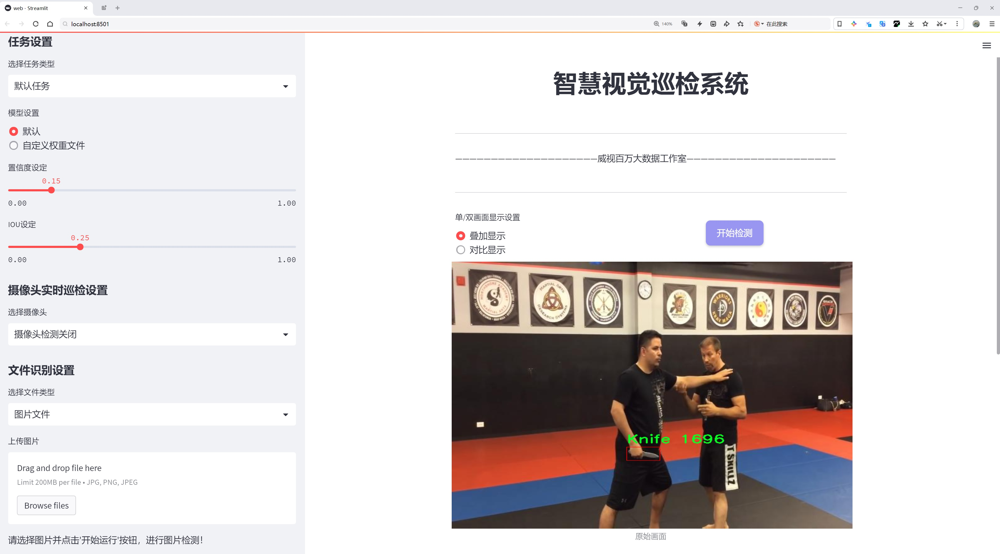
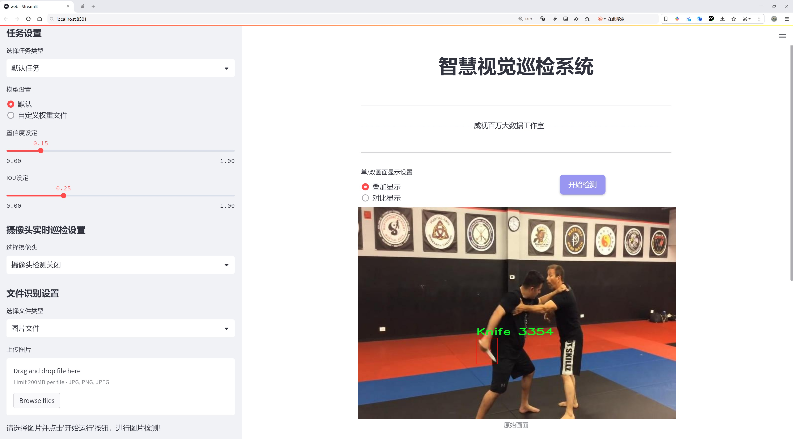
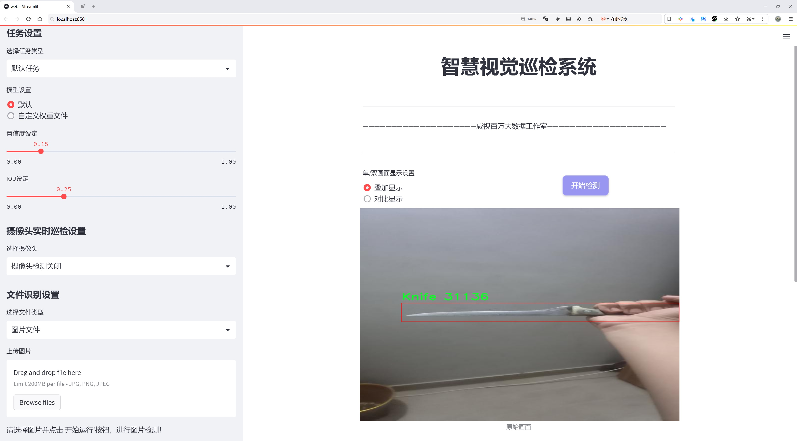
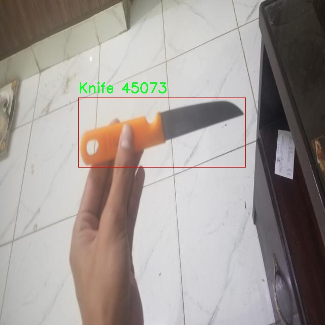
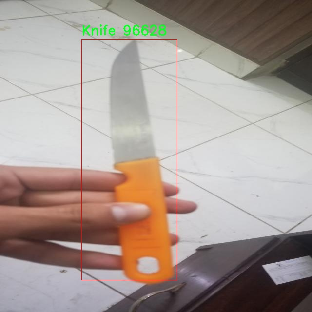
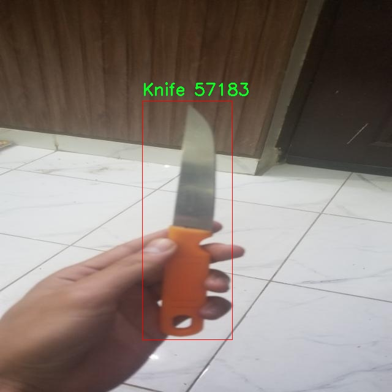
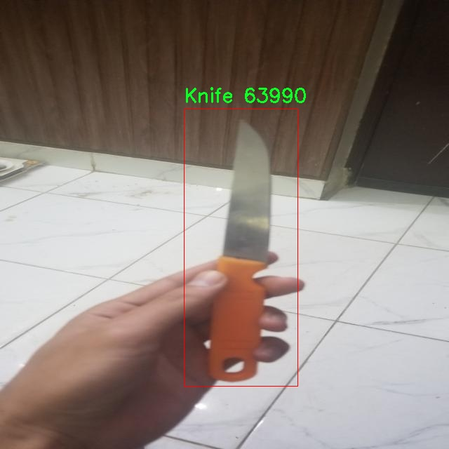
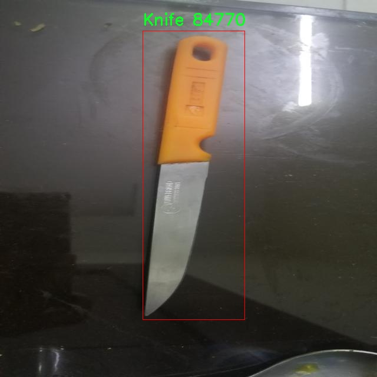

# 武器检测检测系统源码分享
 # [一条龙教学YOLOV8标注好的数据集一键训练_70+全套改进创新点发刊_Web前端展示]

### 1.研究背景与意义

项目参考[AAAI Association for the Advancement of Artificial Intelligence](https://gitee.com/qunshansj/projects)

项目来源[AACV Association for the Advancement of Computer Vision](https://gitee.com/qunmasj/projects)

研究背景与意义

随着科技的迅猛发展，武器检测技术在公共安全、反恐和犯罪预防等领域的重要性日益凸显。传统的武器检测方法多依赖于人工监控和简单的图像处理技术，效率低下且易受人为因素影响。近年来，深度学习技术的快速进步为自动化武器检测提供了新的解决方案，尤其是基于卷积神经网络（CNN）的目标检测模型，如YOLO（You Only Look Once）系列，因其高效性和实时性而受到广泛关注。YOLOv8作为该系列的最新版本，具备更强的特征提取能力和更快的推理速度，适合于复杂环境下的武器检测任务。

本研究旨在基于改进的YOLOv8模型，构建一个高效的武器检测系统。我们所使用的数据集包含9200张图像，涵盖了六个类别：重型枪械、刀具、人员、手枪、刀具（重复类别）和“pisau”（印尼语中的刀具）。这些类别的多样性使得模型在训练过程中能够学习到不同武器的特征，从而提高检测的准确性和鲁棒性。特别是在当前全球安全形势日益严峻的背景下，能够快速、准确地识别潜在威胁，显得尤为重要。

本研究的意义不仅在于技术层面的创新，更在于其对社会安全的积极影响。通过改进YOLOv8模型，我们希望能够提升武器检测系统在实际应用中的表现，尤其是在公共场所、交通枢纽和大型活动等人流密集区域。有效的武器检测系统能够在潜在危险发生之前，及时识别并报警，从而为安全管理提供有力支持，减少暴力事件的发生。

此外，随着数据集的不断丰富和模型的持续优化，武器检测系统的应用场景将不断扩展。例如，在智能监控、无人机巡逻和安检系统中，基于深度学习的武器检测技术能够实现更高效的安全防范。通过与其他智能技术的结合，如人脸识别、行为分析等，未来的武器检测系统将更加智能化，能够在复杂环境中进行多任务处理，提高整体安全防护能力。

综上所述，基于改进YOLOv8的武器检测系统的研究，不仅具有重要的学术价值，也对社会安全和公共管理具有深远的现实意义。通过本研究，我们希望能够为武器检测技术的发展贡献一份力量，为建设更加安全的社会环境提供有力的技术支持。

### 2.图片演示







##### 注意：由于此博客编辑较早，上面“2.图片演示”和“3.视频演示”展示的系统图片或者视频可能为老版本，新版本在老版本的基础上升级如下：（实际效果以升级的新版本为准）

  （1）适配了YOLOV8的“目标检测”模型和“实例分割”模型，通过加载相应的权重（.pt）文件即可自适应加载模型。

  （2）支持“图片识别”、“视频识别”、“摄像头实时识别”三种识别模式。

  （3）支持“图片识别”、“视频识别”、“摄像头实时识别”三种识别结果保存导出，解决手动导出（容易卡顿出现爆内存）存在的问题，识别完自动保存结果并导出到tempDir中。

  （4）支持Web前端系统中的标题、背景图等自定义修改，后面提供修改教程。

  另外本项目提供训练的数据集和训练教程,暂不提供权重文件（best.pt）,需要您按照教程进行训练后实现图片演示和Web前端界面演示的效果。

### 3.视频演示

[3.1 视频演示](https://www.bilibili.com/video/BV17xtjeMEMG/)

### 4.数据集信息展示

##### 4.1 本项目数据集详细数据（类别数＆类别名）

nc: 1
names: ['Knife']


##### 4.2 本项目数据集信息介绍

数据集信息展示

在现代计算机视觉领域，物体检测技术的进步为安全监控、公共安全以及智能安防系统的发展提供了强有力的支持。为此，构建一个高效、准确的武器检测系统显得尤为重要。本项目旨在通过改进YOLOv8模型，专注于刀具的检测与识别，因此我们选用了名为“knife-detection”的数据集。该数据集专门针对刀具的识别任务，具备良好的应用前景。

“knife-detection”数据集的设计初衷是为了解决在各种环境中对刀具的准确检测问题。该数据集包含了丰富的刀具图像样本，旨在帮助训练模型以提高其在实际应用中的性能。数据集中仅包含一个类别，即“Knife”，这意味着所有的图像样本均围绕这一特定物体展开。这种专一性使得模型在学习过程中能够集中注意力，深入理解刀具的特征，从而提升检测的准确性和鲁棒性。

数据集的构建过程涉及到多种拍摄条件和环境设置，以确保模型在不同场景下的适应能力。图像样本可能来源于各种背景，如厨房、餐厅、户外等，且在不同的光照条件下拍摄。这种多样性使得模型在面对现实世界中复杂的环境时，能够更好地进行刀具的识别与定位。此外，数据集中还可能包含不同类型的刀具，如厨刀、折叠刀等，尽管它们都归属于同一类别，但其形状、颜色和大小的差异为模型的学习提供了丰富的特征信息。

在数据集的标注过程中，采用了精确的边界框标注技术，确保每个刀具在图像中的位置都被准确标识。这种高质量的标注不仅有助于模型在训练时进行有效的学习，也为后续的验证和测试提供了可靠的依据。数据集的大小和样本数量虽然未具体列出，但可以推测，数据集的丰富性和多样性是其核心优势之一，能够有效支持YOLOv8模型的训练需求。

为了进一步提升模型的性能，数据集还可以通过数据增强技术进行扩展，例如旋转、缩放、翻转等。这些技术不仅可以增加样本的多样性，还能提高模型的泛化能力，使其在未见过的图像中也能保持良好的检测效果。通过这种方式，刀具检测系统能够在实际应用中更好地应对各种挑战，提升安全监控的有效性。

总之，“knife-detection”数据集为改进YOLOv8的武器检测系统提供了坚实的基础。通过对刀具的专注研究，数据集不仅涵盖了丰富的样本和多样的拍摄条件，还通过精确的标注和可能的数据增强策略，为模型的训练提供了强有力的支持。未来，随着数据集的不断扩展和模型的持续优化，我们有理由相信，刀具检测系统将在安全领域发挥越来越重要的作用。











### 5.全套项目环境部署视频教程（零基础手把手教学）

[5.1 环境部署教程链接（零基础手把手教学）](https://www.ixigua.com/7404473917358506534?logTag=c807d0cbc21c0ef59de5)


[5.2 安装Python虚拟环境创建和依赖库安装视频教程链接（零基础手把手教学）](https://www.ixigua.com/7404474678003106304?logTag=1f1041108cd1f708b01a)

### 6.手把手YOLOV8训练视频教程（零基础小白有手就能学会）

[6.1 手把手YOLOV8训练视频教程（零基础小白有手就能学会）](https://www.ixigua.com/7404477157818401292?logTag=d31a2dfd1983c9668658)

### 7.70+种全套YOLOV8创新点代码加载调参视频教程（一键加载写好的改进模型的配置文件）

[7.1 70+种全套YOLOV8创新点代码加载调参视频教程（一键加载写好的改进模型的配置文件）](https://www.ixigua.com/7404478314661806627?logTag=29066f8288e3f4eea3a4)

### 8.70+种全套YOLOV8创新点原理讲解（非科班也可以轻松写刊发刊，V10版本正在科研待更新）

由于篇幅限制，每个创新点的具体原理讲解就不一一展开，具体见下列网址中的创新点对应子项目的技术原理博客网址【Blog】：


[8.1 70+种全套YOLOV8创新点原理讲解链接](https://gitee.com/qunmasj/good)

### 9.系统功能展示（检测对象为举例，实际内容以本项目数据集为准）

图9.1.系统支持检测结果表格显示

  图9.2.系统支持置信度和IOU阈值手动调节

  图9.3.系统支持自定义加载权重文件best.pt(需要你通过步骤5中训练获得)

  图9.4.系统支持摄像头实时识别

  图9.5.系统支持图片识别

  图9.6.系统支持视频识别

  图9.7.系统支持识别结果文件自动保存

  图9.8.系统支持Excel导出检测结果数据


### 10.原始YOLOV8算法原理

原始YOLOv8算法原理

YOLOv8（You Only Look Once version 8）是计算机视觉领域中的一个重要里程碑，它在目标检测、图像分类和实例分割等任务中展现出了卓越的性能。作为YOLO系列的最新版本，YOLOv8在算法设计和实现上进行了多项创新，旨在提升检测精度、推理速度以及模型的易用性。其核心结构由三个主要部分组成：Backbone（骨干网络）、Neck（颈部结构）和Head（头部结构），每个部分在整个模型中发挥着不可或缺的作用。

在YOLOv8的Backbone部分，特征提取是其首要任务。YOLOv8引入了新的骨干网络设计，优化了卷积层的结构，使得特征提取的效率和效果得到了显著提升。具体而言，YOLOv8将第一个卷积层的卷积核大小从6x6缩小至3x3，这一变化不仅减少了计算量，还提高了特征提取的细致程度。此外，YOLOv8采用了CSP（Cross Stage Partial）结构，通过引入跳层连接和Split操作，增强了网络的表达能力。这种设计使得模型在提取特征时，能够更好地捕捉到不同层次的信息，从而提升了后续检测任务的准确性。

Neck部分则负责特征的融合。YOLOv8使用了PAN-FPN（Path Aggregation Network - Feature Pyramid Network）结构，通过多层次的特征融合，确保了不同尺度目标的检测能力。PAN-FPN通过将低层次的细节特征与高层次的语义特征进行结合，形成了一个更加丰富的特征表示。这种特征融合策略不仅提升了小目标的检测能力，也增强了对高分辨率图像的处理能力，使得YOLOv8在多种场景下都能保持良好的性能。

在Head部分，YOLOv8的创新尤为显著。传统的YOLO模型通常采用Anchor-Based的检测头，而YOLOv8则转向了Anchor-Free的设计。这一转变意味着模型不再依赖于预定义的锚框，而是通过解耦的分类和回归分支，直接预测目标的位置和类别。这种设计的优势在于，它减少了模型的复杂性，提高了训练和推理的效率。同时，YOLOv8还去掉了objectness分支，进一步简化了网络结构，使得模型在执行时更加高效。

在损失函数的设计上，YOLOv8也进行了优化，以适应新的检测头结构。新的损失函数不仅考虑了分类和回归的准确性，还通过更合理的权重分配，提升了模型在不同任务上的表现。这一改进使得YOLOv8在训练过程中能够更快地收敛，从而在较短的时间内达到较高的精度。

YOLOv8的另一个重要特点是其灵活性和可扩展性。模型提供了多个参数设置，如depth_factor和width_factor，用户可以根据具体需求调整模型的深度和宽度。这种灵活性使得YOLOv8能够适应不同的应用场景，从嵌入式设备到高性能服务器，均能实现高效的目标检测。此外，YOLOv8原生支持自定义数据集，使得用户在特定领域的应用中，可以快速构建和训练适合自己需求的模型。

综上所述，YOLOv8通过对骨干网络、特征融合和检测头的多项创新，显著提升了目标检测的性能。其在速度和精度上的优势，使其成为当前计算机视觉领域中最为流行和成功的模型之一。随着YOLOv8的广泛应用，预计将在自动驾驶、安防监控、智能家居等多个领域产生深远的影响。通过不断的优化和改进，YOLOv8不仅为研究人员提供了一个强大的工具，也为实际应用中的目标检测任务提供了新的解决方案。


### 11.项目核心源码讲解（再也不用担心看不懂代码逻辑）

#### 11.1 70+种YOLOv8算法改进源码大全和调试加载训练教程（非必要）\ultralytics\trackers\track.py

以下是对给定代码的核心部分进行分析和详细注释的结果：

```python
# 导入必要的库和模块
from functools import partial
import torch
from ultralytics.utils import IterableSimpleNamespace, yaml_load
from ultralytics.utils.checks import check_yaml
from .bot_sort import BOTSORT
from .byte_tracker import BYTETracker

# 定义跟踪器映射字典，便于根据类型获取相应的跟踪器类
TRACKER_MAP = {'bytetrack': BYTETracker, 'botsort': BOTSORT}

def on_predict_start(predictor, persist=False):
    """
    在预测开始时初始化对象跟踪器。

    参数:
        predictor (object): 用于初始化跟踪器的预测器对象。
        persist (bool, optional): 是否在跟踪器已存在时保持其状态。默认为 False。

    异常:
        AssertionError: 如果 tracker_type 不是 'bytetrack' 或 'botsort'。
    """
    # 如果预测器已经有跟踪器且需要保持状态，则直接返回
    if hasattr(predictor, 'trackers') and persist:
        return
    
    # 检查并加载跟踪器的配置文件
    tracker = check_yaml(predictor.args.tracker)
    cfg = IterableSimpleNamespace(**yaml_load(tracker))
    
    # 确保配置中的跟踪器类型是支持的
    assert cfg.tracker_type in ['bytetrack', 'botsort'], \
        f"Only support 'bytetrack' and 'botsort' for now, but got '{cfg.tracker_type}'"
    
    # 初始化跟踪器列表
    trackers = []
    for _ in range(predictor.dataset.bs):  # 根据批次大小创建跟踪器
        tracker = TRACKER_MAP[cfg.tracker_type](args=cfg, frame_rate=30)
        trackers.append(tracker)
    
    # 将创建的跟踪器分配给预测器
    predictor.trackers = trackers

def on_predict_postprocess_end(predictor):
    """后处理检测到的框并更新对象跟踪。"""
    bs = predictor.dataset.bs  # 批次大小
    im0s = predictor.batch[1]  # 获取输入图像
    for i in range(bs):
        det = predictor.results[i].boxes.cpu().numpy()  # 获取检测结果
        if len(det) == 0:  # 如果没有检测到物体，跳过
            continue
        
        # 更新跟踪器并获取跟踪结果
        tracks = predictor.trackers[i].update(det, im0s[i])
        if len(tracks) == 0:  # 如果没有跟踪到物体，跳过
            continue
        
        idx = tracks[:, -1].astype(int)  # 获取有效的索引
        predictor.results[i] = predictor.results[i][idx]  # 更新检测结果
        predictor.results[i].update(boxes=torch.as_tensor(tracks[:, :-1]))  # 更新框信息

def register_tracker(model, persist):
    """
    为模型注册跟踪回调，以便在预测期间进行对象跟踪。

    参数:
        model (object): 要注册跟踪回调的模型对象。
        persist (bool): 是否在跟踪器已存在时保持其状态。
    """
    # 注册预测开始时的回调
    model.add_callback('on_predict_start', partial(on_predict_start, persist=persist))
    # 注册后处理结束时的回调
    model.add_callback('on_predict_postprocess_end', on_predict_postprocess_end)
```

### 代码分析

1. **导入模块**：代码开始部分导入了必要的模块和类，包括跟踪器的实现（`BYTETracker` 和 `BOTSORT`）以及一些工具函数。

2. **跟踪器映射**：`TRACKER_MAP` 字典用于根据配置选择相应的跟踪器类。

3. **`on_predict_start` 函数**：
   - 该函数在预测开始时被调用，用于初始化跟踪器。
   - 通过检查配置文件，确保所选的跟踪器类型是支持的（`bytetrack` 或 `botsort`）。
   - 根据批次大小创建相应数量的跟踪器实例，并将其存储在预测器对象中。

4. **`on_predict_postprocess_end` 函数**：
   - 该函数在预测后处理结束时被调用，用于更新检测结果。
   - 它会遍历每个批次的检测结果，调用相应的跟踪器进行更新，并根据跟踪结果更新预测器的结果。

5. **`register_tracker` 函数**：
   - 该函数用于将跟踪回调注册到模型中，以便在预测过程中自动调用相应的处理函数。

这些核心部分和注释提供了对代码功能的清晰理解，帮助开发者在进行对象跟踪时能够正确使用和扩展该功能。

这个文件是YOLO（You Only Look Once）系列算法中的一个跟踪器模块，主要用于在目标检测过程中实现对象跟踪功能。文件中引入了一些必要的库和模块，并定义了一些函数来处理目标跟踪的初始化和后处理。

首先，文件导入了`partial`函数用于创建部分应用的函数，`torch`库用于深度学习相关的操作，以及一些来自`ultralytics`库的工具函数和类。`TRACKER_MAP`字典则映射了不同的跟踪器类型到具体的实现类，当前支持的跟踪器有`BYTETracker`和`BOTSORT`。

`on_predict_start`函数在预测开始时被调用，用于初始化跟踪器。它接受一个预测器对象和一个可选的持久化参数。如果预测器已经有跟踪器并且持久化参数为真，则直接返回。否则，它会检查配置文件中指定的跟踪器类型，并确保其为支持的类型之一。接着，函数会为每个批次的图像创建相应的跟踪器实例，并将其存储在预测器的`trackers`属性中。

`on_predict_postprocess_end`函数在预测后处理结束时被调用，用于更新检测到的目标框并进行对象跟踪。它首先获取当前批次的大小和图像数据，然后对每个图像进行处理。如果检测到的目标框为空，则跳过该图像。否则，调用相应的跟踪器更新方法，并根据跟踪结果更新预测器的结果。

最后，`register_tracker`函数用于将跟踪回调函数注册到模型中，以便在预测过程中能够调用这些函数。它接受模型对象和持久化参数，并将`on_predict_start`和`on_predict_postprocess_end`函数作为回调函数添加到模型中。

总体来说，这个文件的主要功能是为YOLO模型提供对象跟踪的能力，通过在预测的不同阶段插入跟踪器的初始化和后处理逻辑，增强了目标检测的实用性和准确性。

#### 11.2 code\ultralytics\utils\metrics.py

以下是代码中最核心的部分，并附上详细的中文注释：

```python
import numpy as np
import torch

def box_iou(box1, box2, eps=1e-7):
    """
    计算两个边界框的交并比（IoU）。两个边界框都应该是 (x1, y1, x2, y2) 格式。
    
    参数：
        box1 (torch.Tensor): 形状为 (N, 4) 的张量，表示 N 个边界框。
        box2 (torch.Tensor): 形状为 (M, 4) 的张量，表示 M 个边界框。
        eps (float, optional): 避免除以零的小值。默认值为 1e-7。

    返回：
        (torch.Tensor): 形状为 (N, M) 的张量，包含 box1 和 box2 中每对边界框的 IoU 值。
    """

    # 获取边界框的坐标
    (a1, a2), (b1, b2) = box1.unsqueeze(1).chunk(2, 2), box2.unsqueeze(0).chunk(2, 2)
    
    # 计算交集面积
    inter = (torch.min(a2, b2) - torch.max(a1, b1)).clamp_(0).prod(2)

    # 计算 IoU = 交集 / (面积1 + 面积2 - 交集)
    return inter / ((a2 - a1).prod(2) + (b2 - b1).prod(2) - inter + eps)

def bbox_iou(box1, box2, xywh=True, eps=1e-7):
    """
    计算 box1 (1, 4) 和 box2 (n, 4) 的交并比（IoU）。

    参数：
        box1 (torch.Tensor): 形状为 (1, 4) 的张量，表示单个边界框。
        box2 (torch.Tensor): 形状为 (n, 4) 的张量，表示 n 个边界框。
        xywh (bool, optional): 如果为 True，输入框为 (x, y, w, h) 格式；如果为 False，输入框为 (x1, y1, x2, y2) 格式。默认值为 True。
        eps (float, optional): 避免除以零的小值。默认值为 1e-7。

    返回：
        (torch.Tensor): IoU 值。
    """

    # 获取边界框的坐标
    if xywh:  # 从 xywh 转换为 xyxy
        (x1, y1, w1, h1), (x2, y2, w2, h2) = box1.chunk(4, -1), box2.chunk(4, -1)
        w1_, h1_, w2_, h2_ = w1 / 2, h1 / 2, w2 / 2, h2 / 2
        b1_x1, b1_x2, b1_y1, b1_y2 = x1 - w1_, x1 + w1_, y1 - h1_, y1 + h1_
        b2_x1, b2_x2, b2_y1, b2_y2 = x2 - w2_, x2 + w2_, y2 - h2_, y2 + h2_
    else:  # x1, y1, x2, y2 = box1
        b1_x1, b1_y1, b1_x2, b1_y2 = box1.chunk(4, -1)
        b2_x1, b2_y1, b2_x2, b2_y2 = box2.chunk(4, -1)

    # 计算交集面积
    inter = (b1_x2.minimum(b2_x2) - b1_x1.maximum(b2_x1)).clamp_(0) * (
        b1_y2.minimum(b2_y2) - b1_y1.maximum(b2_y1)
    ).clamp_(0)

    # 计算并集面积
    union = (b1_x2 - b1_x1) * (b1_y2 - b1_y1 + eps) + (b2_x2 - b2_x1) * (b2_y2 - b2_y1 + eps) - inter + eps

    # 计算 IoU
    return inter / union

def compute_ap(recall, precision):
    """
    计算给定召回率和精确率曲线的平均精度（AP）。

    参数：
        recall (list): 召回率曲线。
        precision (list): 精确率曲线。

    返回：
        (float): 平均精度。
        (np.ndarray): 精确率包络曲线。
        (np.ndarray): 修改后的召回率曲线，开头和结尾添加了哨兵值。
    """

    # 在开头和结尾添加哨兵值
    mrec = np.concatenate(([0.0], recall, [1.0]))
    mpre = np.concatenate(([1.0], precision, [0.0]))

    # 计算精确率包络
    mpre = np.flip(np.maximum.accumulate(np.flip(mpre)))

    # 计算曲线下面积
    x = np.linspace(0, 1, 101)  # 101 点插值（COCO）
    ap = np.trapz(np.interp(x, mrec, mpre), x)  # 积分

    return ap, mpre, mrec
```

### 代码说明：
1. **box_iou**: 计算两个边界框的交并比（IoU），用于评估目标检测的性能。
2. **bbox_iou**: 计算单个边界框与多个边界框的 IoU，支持不同的输入格式（xywh 或 xyxy）。
3. **compute_ap**: 计算平均精度（AP），用于评估模型在不同召回率下的精确度表现。通过计算精确率和召回率的曲线下面积来实现。

这些函数是目标检测模型评估的核心部分，帮助计算模型的性能指标。

这个程序文件 `metrics.py` 是用于计算和评估目标检测模型（如 YOLO）性能的各种指标的实现。文件中包含了多个函数和类，主要用于计算交并比（IoU）、平均精度（AP）、混淆矩阵等指标。

首先，文件中定义了一些常量和导入了必要的库，包括数学计算、警告处理、路径操作、绘图工具和深度学习框架 PyTorch。`OKS_SIGMA` 是一个用于计算关键点相似度的标准差数组。

接下来，定义了一系列函数来计算不同类型的 IoU 和相关指标。`bbox_ioa` 函数计算两个边界框之间的交集与第二个框的面积比，而 `box_iou` 函数则计算两个框的交并比。`bbox_iou` 函数支持多种输入格式，并可以计算标准 IoU、广义 IoU（GIoU）、距离 IoU（DIoU）和完整 IoU（CIoU）。

`mask_iou` 函数用于计算掩膜的 IoU，`kpt_iou` 函数则计算对象关键点相似度（OKS），它基于关键点的距离和区域大小来评估预测的关键点与真实关键点之间的相似性。

`ConfusionMatrix` 类用于计算和更新混淆矩阵，支持分类和检测任务。它提供了处理分类预测和检测结果的方法，能够更新混淆矩阵并计算真正例、假正例等指标。该类还提供了绘制混淆矩阵的功能。

`Metric` 类用于计算 YOLO 模型的评估指标，包括精度、召回率和平均精度等。它提供了计算每个类的平均精度、均值等方法，并能够更新评估结果。

`DetMetrics` 和 `SegmentMetrics` 类分别用于计算检测和分割任务的指标，支持处理真实标签和预测结果，并计算相应的性能指标。

`ClassifyMetrics` 类则专注于分类任务的指标计算，包括 top-1 和 top-5 准确率。

最后，`OBBMetrics` 类用于计算定向边界框的相关指标，支持处理预测结果并更新性能指标。

整体而言，这个文件提供了全面的工具和方法，用于评估目标检测和分类模型的性能，支持多种评估指标的计算和可视化。

#### 11.3 ui.py

```python
import sys
import subprocess

def run_script(script_path):
    """
    使用当前 Python 环境运行指定的脚本。

    Args:
        script_path (str): 要运行的脚本路径

    Returns:
        None
    """
    # 获取当前 Python 解释器的路径
    python_path = sys.executable

    # 构建运行命令，使用 streamlit 运行指定的脚本
    command = f'"{python_path}" -m streamlit run "{script_path}"'

    # 执行命令
    result = subprocess.run(command, shell=True)
    # 检查命令执行结果，如果返回码不为0，表示执行出错
    if result.returncode != 0:
        print("脚本运行出错。")


# 实例化并运行应用
if __name__ == "__main__":
    # 指定要运行的脚本路径
    script_path = "web.py"  # 这里可以直接指定脚本名，假设它在当前目录下

    # 调用函数运行脚本
    run_script(script_path)
```

### 代码注释说明：
1. **导入模块**：
   - `sys`：用于获取当前 Python 解释器的路径。
   - `subprocess`：用于执行外部命令。

2. **定义 `run_script` 函数**：
   - 接收一个参数 `script_path`，表示要运行的 Python 脚本的路径。
   - 使用 `sys.executable` 获取当前 Python 解释器的路径，以确保使用正确的 Python 环境来运行脚本。
   - 构建命令字符串，使用 `streamlit` 模块运行指定的脚本。
   - 使用 `subprocess.run` 执行构建的命令，并通过 `shell=True` 允许在 shell 中执行命令。
   - 检查命令的返回码，如果不为0，打印错误信息。

3. **主程序块**：
   - 使用 `if __name__ == "__main__":` 确保只有在直接运行该脚本时才会执行以下代码。
   - 指定要运行的脚本路径为 `web.py`，假设该脚本与当前脚本在同一目录下。
   - 调用 `run_script` 函数，传入脚本路径以运行该脚本。

这个程序文件名为 `ui.py`，主要功能是使用当前的 Python 环境来运行一个指定的脚本，具体是一个名为 `web.py` 的文件。程序首先导入了必要的模块，包括 `sys`、`os` 和 `subprocess`，这些模块分别用于获取系统信息、处理文件路径和执行外部命令。

在文件中定义了一个名为 `run_script` 的函数，该函数接受一个参数 `script_path`，表示要运行的脚本的路径。函数内部首先获取当前 Python 解释器的路径，使用 `sys.executable` 来实现。接着，构建一个命令字符串，这个命令将使用 `streamlit` 模块来运行指定的脚本。具体来说，命令的格式是 `"{python_path}" -m streamlit run "{script_path}"`，其中 `{python_path}` 和 `{script_path}` 会被实际的路径替换。

然后，使用 `subprocess.run` 方法来执行这个命令，`shell=True` 参数表示在一个新的 shell 中执行命令。执行完命令后，程序会检查返回码 `result.returncode`，如果返回码不为 0，说明脚本运行出错，此时会打印出错误信息。

在文件的最后部分，使用 `if __name__ == "__main__":` 语句来确保只有在直接运行该文件时才会执行以下代码。这里指定了要运行的脚本路径为 `web.py`，并调用 `run_script` 函数来执行这个脚本。

总的来说，这个程序的主要作用是提供一个简单的接口，通过命令行运行一个 Streamlit 应用，便于开发和测试。

#### 11.4 train.py

以下是代码中最核心的部分，并附上详细的中文注释：

```python
class DetectionTrainer(BaseTrainer):
    """
    DetectionTrainer类扩展了BaseTrainer类，用于基于检测模型的训练。
    """

    def build_dataset(self, img_path, mode="train", batch=None):
        """
        构建YOLO数据集。

        参数:
            img_path (str): 包含图像的文件夹路径。
            mode (str): 模式，`train`表示训练模式，`val`表示验证模式，用户可以为每种模式自定义不同的增强。
            batch (int, optional): 批次大小，仅用于`rect`模式。默认为None。
        """
        gs = max(int(de_parallel(self.model).stride.max() if self.model else 0), 32)  # 获取模型的最大步幅
        return build_yolo_dataset(self.args, img_path, batch, self.data, mode=mode, rect=mode == "val", stride=gs)

    def get_dataloader(self, dataset_path, batch_size=16, rank=0, mode="train"):
        """构造并返回数据加载器。"""
        assert mode in ["train", "val"]  # 确保模式是训练或验证
        with torch_distributed_zero_first(rank):  # 在分布式环境中，仅初始化一次数据集
            dataset = self.build_dataset(dataset_path, mode, batch_size)  # 构建数据集
        shuffle = mode == "train"  # 训练模式下打乱数据
        if getattr(dataset, "rect", False) and shuffle:
            LOGGER.warning("WARNING ⚠️ 'rect=True'与DataLoader的shuffle不兼容，设置shuffle=False")
            shuffle = False
        workers = self.args.workers if mode == "train" else self.args.workers * 2  # 根据模式设置工作线程数
        return build_dataloader(dataset, batch_size, workers, shuffle, rank)  # 返回数据加载器

    def preprocess_batch(self, batch):
        """对一批图像进行预处理，包括缩放和转换为浮点数。"""
        batch["img"] = batch["img"].to(self.device, non_blocking=True).float() / 255  # 将图像转移到设备并归一化
        if self.args.multi_scale:  # 如果启用多尺度
            imgs = batch["img"]
            sz = (
                random.randrange(self.args.imgsz * 0.5, self.args.imgsz * 1.5 + self.stride)
                // self.stride
                * self.stride
            )  # 随机选择新的图像大小
            sf = sz / max(imgs.shape[2:])  # 计算缩放因子
            if sf != 1:
                ns = [
                    math.ceil(x * sf / self.stride) * self.stride for x in imgs.shape[2:]
                ]  # 计算新的形状
                imgs = nn.functional.interpolate(imgs, size=ns, mode="bilinear", align_corners=False)  # 进行插值缩放
            batch["img"] = imgs  # 更新批次中的图像
        return batch

    def get_model(self, cfg=None, weights=None, verbose=True):
        """返回YOLO检测模型。"""
        model = DetectionModel(cfg, nc=self.data["nc"], verbose=verbose and RANK == -1)  # 创建检测模型
        if weights:
            model.load(weights)  # 加载权重
        return model

    def get_validator(self):
        """返回用于YOLO模型验证的DetectionValidator。"""
        self.loss_names = "box_loss", "cls_loss", "dfl_loss"  # 定义损失名称
        return yolo.detect.DetectionValidator(
            self.test_loader, save_dir=self.save_dir, args=copy(self.args), _callbacks=self.callbacks
        )  # 返回验证器

    def plot_training_samples(self, batch, ni):
        """绘制带有注释的训练样本。"""
        plot_images(
            images=batch["img"],
            batch_idx=batch["batch_idx"],
            cls=batch["cls"].squeeze(-1),
            bboxes=batch["bboxes"],
            paths=batch["im_file"],
            fname=self.save_dir / f"train_batch{ni}.jpg",
            on_plot=self.on_plot,
        )  # 绘制图像

    def plot_metrics(self):
        """从CSV文件中绘制指标。"""
        plot_results(file=self.csv, on_plot=self.on_plot)  # 保存结果图像
```

### 代码核心部分解释：
1. **DetectionTrainer类**：这是一个用于训练YOLO检测模型的类，继承自`BaseTrainer`。
2. **build_dataset方法**：构建YOLO数据集，接受图像路径、模式和批次大小作为参数。
3. **get_dataloader方法**：构造数据加载器，确保在分布式环境中仅初始化一次数据集。
4. **preprocess_batch方法**：对图像批次进行预处理，包括归一化和可能的缩放。
5. **get_model方法**：返回一个YOLO检测模型，可以选择加载预训练权重。
6. **get_validator方法**：返回一个用于模型验证的验证器。
7. **plot_training_samples和plot_metrics方法**：用于可视化训练样本和训练过程中的指标。

这个程序文件 `train.py` 是一个用于训练 YOLO（You Only Look Once）目标检测模型的实现，继承自 `BaseTrainer` 类。程序的主要功能是构建数据集、加载数据、预处理图像、设置模型属性、获取模型、验证模型、记录损失、显示训练进度、绘制训练样本和指标等。

在文件的开头，导入了一些必要的库和模块，包括数学运算、随机数生成、深度学习相关的库（如 PyTorch）以及 YOLO 模型和数据处理的相关模块。

`DetectionTrainer` 类是该文件的核心，包含多个方法来支持训练过程。`build_dataset` 方法用于构建 YOLO 数据集，接受图像路径、模式（训练或验证）和批次大小作为参数。它通过调用 `build_yolo_dataset` 函数来创建数据集，并根据模式选择不同的增强方式。

`get_dataloader` 方法用于构建数据加载器，确保在分布式训练时只初始化一次数据集。它根据模式选择是否打乱数据，并设置工作线程的数量。数据加载器的返回值将用于后续的训练过程。

`preprocess_batch` 方法对图像批次进行预处理，包括将图像缩放到适当的大小并转换为浮点数格式。它还支持多尺度训练，通过随机选择图像大小来增强模型的鲁棒性。

`set_model_attributes` 方法用于设置模型的属性，包括类别数量和类别名称等。这些属性将帮助模型在训练过程中进行适当的调整。

`get_model` 方法返回一个 YOLO 检测模型的实例，并可以加载预训练权重。`get_validator` 方法返回一个用于验证模型的检测验证器。

`label_loss_items` 方法用于返回带有标签的训练损失项字典，这对于目标检测和分割任务是必要的。`progress_string` 方法生成一个格式化的字符串，用于显示训练进度，包括当前的 epoch、GPU 内存使用情况、损失值、实例数量和图像大小。

`plot_training_samples` 方法用于绘制训练样本及其注释，以便可视化训练过程中的数据。`plot_metrics` 方法从 CSV 文件中绘制指标，以便分析训练结果。最后，`plot_training_labels` 方法创建一个带标签的训练图，显示模型在训练数据上的表现。

总体而言，这个程序文件实现了 YOLO 模型的训练流程，涵盖了数据处理、模型构建、训练监控和结果可视化等多个方面，为目标检测任务提供了一个完整的解决方案。

#### 11.5 code\ultralytics\solutions\object_counter.py

以下是经过简化并添加详细中文注释的核心代码部分：

```python
# 导入必要的库
from collections import defaultdict
import cv2
from shapely.geometry import LineString, Point, Polygon

class ObjectCounter:
    """管理实时视频流中对象计数的类。"""

    def __init__(self):
        """初始化计数器，设置默认参数。"""
        # 鼠标事件相关
        self.is_drawing = False  # 是否正在绘制
        self.selected_point = None  # 选中的点

        # 区域和线的信息
        self.reg_pts = [(20, 400), (1260, 400)]  # 默认的计数区域点
        self.line_dist_thresh = 15  # 线距离阈值
        self.counting_region = None  # 计数区域
        self.region_color = (255, 0, 255)  # 区域颜色
        self.region_thickness = 5  # 区域线条厚度

        # 图像和注释信息
        self.im0 = None  # 当前图像
        self.view_img = False  # 是否显示图像
        self.view_in_counts = True  # 是否显示进入计数
        self.view_out_counts = True  # 是否显示离开计数

        # 计数信息
        self.in_counts = 0  # 进入计数
        self.out_counts = 0  # 离开计数
        self.counting_list = []  # 当前计数的对象列表

        # 跟踪信息
        self.track_history = defaultdict(list)  # 跟踪历史
        self.track_color = (0, 255, 0)  # 跟踪线颜色

    def set_args(self, classes_names, reg_pts):
        """
        配置计数器的参数。

        Args:
            classes_names (dict): 类别名称
            reg_pts (list): 定义计数区域的点
        """
        self.reg_pts = reg_pts  # 设置计数区域点
        # 根据提供的点数设置计数区域类型
        if len(reg_pts) == 2:
            self.counting_region = LineString(self.reg_pts)  # 线性计数
        elif len(reg_pts) == 4:
            self.counting_region = Polygon(self.reg_pts)  # 区域计数
        else:
            raise ValueError("无效的区域点，区域点可以是2或4个")

        self.names = classes_names  # 设置类别名称

    def extract_and_process_tracks(self, tracks):
        """提取并处理视频流中的跟踪信息以进行对象计数。"""
        boxes = tracks[0].boxes.xyxy.cpu()  # 获取边界框
        clss = tracks[0].boxes.cls.cpu().tolist()  # 获取类别
        track_ids = tracks[0].boxes.id.int().cpu().tolist()  # 获取跟踪ID

        # 遍历每个检测到的对象
        for box, track_id, cls in zip(boxes, track_ids, clss):
            # 计算对象是否进入或离开计数区域
            prev_position = self.track_history[track_id][-2] if len(self.track_history[track_id]) > 1 else None
            if prev_position is not None:
                # 判断对象是否进入计数区域
                if self.counting_region.contains(Point(box[0], box[1])) and track_id not in self.counting_list:
                    self.counting_list.append(track_id)
                    if (box[0] - prev_position[0]) > 0:  # 判断方向
                        self.in_counts += 1  # 进入计数
                    else:
                        self.out_counts += 1  # 离开计数

    def display_frames(self):
        """显示当前帧。"""
        cv2.imshow("Object Counter", self.im0)  # 显示图像
        if cv2.waitKey(1) & 0xFF == ord("q"):  # 按'q'退出
            return

    def start_counting(self, im0, tracks):
        """
        启动对象计数过程。

        Args:
            im0 (ndarray): 当前视频帧。
            tracks (list): 从对象跟踪过程中获得的跟踪列表。
        """
        self.im0 = im0  # 存储当前图像
        if tracks[0].boxes.id is None:
            self.display_frames()  # 如果没有检测到对象，直接显示帧
            return
        self.extract_and_process_tracks(tracks)  # 提取和处理跟踪信息
        self.display_frames()  # 显示处理后的帧

if __name__ == "__main__":
    ObjectCounter()  # 创建对象计数器实例
```

### 代码说明：
1. **类 `ObjectCounter`**：负责管理对象计数的主要逻辑，包括初始化参数、设置计数区域、处理跟踪信息和显示结果。
2. **初始化方法 `__init__`**：设置默认参数，包括鼠标事件、计数区域、计数信息等。
3. **`set_args` 方法**：配置计数器的参数，包括类别名称和计数区域的点。
4. **`extract_and_process_tracks` 方法**：提取跟踪信息并更新计数，判断对象是否进入或离开指定区域。
5. **`display_frames` 方法**：显示当前处理的图像帧。
6. **`start_counting` 方法**：启动计数过程，处理每一帧图像和跟踪信息。

这个程序文件是一个用于实时视频流中对象计数的类，名为`ObjectCounter`。它主要依赖于计算机视觉库OpenCV和几何库Shapely来处理视频帧和对象的跟踪。

在初始化时，`ObjectCounter`类设置了一些默认值，包括鼠标事件的状态、计数区域的点、线的厚度、计数的颜色、跟踪的历史记录等。它还检查环境是否支持图像显示。

`set_args`方法允许用户配置计数器的参数，包括类别名称、计数区域的点、颜色、线的厚度等。根据提供的点的数量，程序会决定是使用线计数器还是区域计数器。

`mouse_event_for_region`方法处理鼠标事件，允许用户通过鼠标拖动来调整计数区域的形状。当用户按下鼠标左键时，程序会检查鼠标位置是否接近计数区域的点，并允许用户拖动这些点来重新定义区域。

`extract_and_process_tracks`方法提取和处理对象的跟踪信息，包括绘制边界框、跟踪线和计数对象的进入和离开。它根据对象的历史位置和当前的位置判断对象是进入还是离开计数区域，并更新相应的计数。

`display_frames`方法用于显示当前帧，并在需要时设置鼠标回调函数以允许用户调整计数区域。

`start_counting`方法是主要的计数过程，它接收当前帧和跟踪信息，调用提取和处理函数，并在需要时显示帧。

最后，如果该文件作为主程序运行，则会创建一个`ObjectCounter`的实例。这个类的设计使得用户能够灵活地在视频流中定义计数区域，并实时跟踪和计数进入和离开的对象。

#### 11.6 code\ultralytics\nn\tasks.py

以下是经过简化并添加详细中文注释的核心代码部分：

```python
import torch
import torch.nn as nn

class BaseModel(nn.Module):
    """BaseModel类是Ultralytics YOLO系列模型的基类。"""

    def forward(self, x, *args, **kwargs):
        """
        模型的前向传播方法，处理单个尺度的输入。

        参数:
            x (torch.Tensor | dict): 输入图像张量或包含图像张量和真实标签的字典。

        返回:
            (torch.Tensor): 网络的输出。
        """
        if isinstance(x, dict):  # 如果输入是字典，进行损失计算
            return self.loss(x, *args, **kwargs)
        return self.predict(x, *args, **kwargs)  # 否则进行预测

    def predict(self, x, profile=False, visualize=False, augment=False, embed=None):
        """
        通过网络进行前向传播。

        参数:
            x (torch.Tensor): 输入张量。
            profile (bool): 如果为True，打印每层的计算时间，默认为False。
            visualize (bool): 如果为True，保存模型的特征图，默认为False。
            augment (bool): 在预测时进行图像增强，默认为False。
            embed (list, optional): 要返回的特征向量/嵌入的列表。

        返回:
            (torch.Tensor): 模型的最后输出。
        """
        if augment:
            return self._predict_augment(x)  # 如果需要增强，调用增强预测方法
        return self._predict_once(x, profile, visualize, embed)  # 否则进行一次预测

    def _predict_once(self, x, profile=False, visualize=False, embed=None):
        """
        执行一次前向传播。

        参数:
            x (torch.Tensor): 输入张量。
            profile (bool): 如果为True，打印每层的计算时间，默认为False。
            visualize (bool): 如果为True，保存模型的特征图，默认为False。
            embed (list, optional): 要返回的特征向量/嵌入的列表。

        返回:
            (torch.Tensor): 模型的最后输出。
        """
        y, dt, embeddings = [], [], []  # 输出列表
        for m in self.model:  # 遍历模型中的每一层
            if m.f != -1:  # 如果不是来自前一层
                x = y[m.f] if isinstance(m.f, int) else [x if j == -1 else y[j] for j in m.f]  # 从早期层获取输入
            if profile:
                self._profile_one_layer(m, x, dt)  # 进行层的性能分析
            x = m(x)  # 执行前向传播
            y.append(x if m.i in self.save else None)  # 保存输出
            if visualize:
                feature_visualization(x, m.type, m.i, save_dir=visualize)  # 可视化特征图
            if embed and m.i in embed:
                embeddings.append(nn.functional.adaptive_avg_pool2d(x, (1, 1)).squeeze(-1).squeeze(-1))  # 扁平化
                if m.i == max(embed):
                    return torch.unbind(torch.cat(embeddings, 1), dim=0)  # 返回嵌入
        return x  # 返回最后的输出

    def loss(self, batch, preds=None):
        """
        计算损失。

        参数:
            batch (dict): 用于计算损失的批次数据。
            preds (torch.Tensor | List[torch.Tensor]): 预测结果。

        返回:
            (torch.Tensor): 计算得到的损失值。
        """
        if not hasattr(self, "criterion"):
            self.criterion = self.init_criterion()  # 初始化损失函数

        preds = self.forward(batch["img"]) if preds is None else preds  # 获取预测结果
        return self.criterion(preds, batch)  # 计算损失

    def init_criterion(self):
        """初始化BaseModel的损失标准。"""
        raise NotImplementedError("compute_loss() needs to be implemented by task heads")


class DetectionModel(BaseModel):
    """YOLOv8检测模型。"""

    def __init__(self, cfg="yolov8n.yaml", ch=3, nc=None, verbose=True):
        """初始化YOLOv8检测模型。"""
        super().__init__()
        self.yaml = cfg if isinstance(cfg, dict) else yaml_model_load(cfg)  # 加载配置

        # 定义模型
        ch = self.yaml["ch"] = self.yaml.get("ch", ch)  # 输入通道
        if nc and nc != self.yaml["nc"]:
            self.yaml["nc"] = nc  # 覆盖类别数
        self.model, self.save = parse_model(deepcopy(self.yaml), ch=ch, verbose=verbose)  # 解析模型
        self.names = {i: f"{i}" for i in range(self.yaml["nc"])}  # 默认名称字典

        # 初始化权重
        initialize_weights(self)

    def init_criterion(self):
        """初始化DetectionModel的损失标准。"""
        return v8DetectionLoss(self)  # 返回YOLOv8检测损失

# 其他模型类（如OBBModel、SegmentationModel等）可在此基础上扩展
```

以上代码是YOLO模型的核心部分，包含了模型的基本结构、前向传播、损失计算等功能。每个方法都附有详细的中文注释，便于理解其功能和用途。

这个程序文件 `tasks.py` 是 Ultralytics YOLO 系列模型的核心部分，主要用于定义不同类型的模型及其相关功能。文件中包含了多个类和函数，分别实现了目标检测、分割、分类、姿态估计等功能。

首先，文件导入了一些必要的库，包括 PyTorch 和一些自定义的模块。`BaseModel` 类是所有模型的基类，提供了模型的前向传播方法和一些基本功能，如加载权重、计算损失、模型信息打印等。`forward` 方法根据输入的类型（图像或字典）选择调用不同的处理方法。`predict` 方法用于执行模型的前向推理，并可以选择性地进行性能分析和可视化。

`DetectionModel` 类继承自 `BaseModel`，专门用于目标检测任务。它的构造函数根据配置文件初始化模型，并计算模型的步幅。`_predict_augment` 方法实现了数据增强的推理过程，允许在推理时对输入图像进行多种变换。

`OBBModel`、`SegmentationModel` 和 `PoseModel` 类分别实现了有向边界框检测、图像分割和姿态估计的功能。这些类都继承自 `DetectionModel`，并在初始化时设置特定的损失函数。

`ClassificationModel` 类用于图像分类任务，具有与其他模型相似的结构，但在模型的最后一层输出上有所不同。

`RTDETRDetectionModel` 类实现了一种基于变换器的实时检测和跟踪模型，具有独特的损失计算和预测方法。

此外，文件中还定义了 `Ensemble` 类，用于将多个模型的输出进行组合，以提高预测的准确性。

文件最后包含了一些辅助函数，如 `torch_safe_load` 用于安全加载模型权重，`attempt_load_weights` 和 `attempt_load_one_weight` 用于加载单个或多个模型的权重，`parse_model` 用于解析模型的 YAML 配置文件，`yaml_model_load` 和 `guess_model_scale` 用于处理模型的 YAML 文件路径和内容。

总的来说，这个文件是 YOLO 系列模型的实现基础，提供了灵活的模型定义和训练、推理的功能。

### 12.系统整体结构（节选）

### 整体功能和构架概括

该项目是一个基于 YOLOv8 的目标检测框架，提供了多种功能模块，包括目标检测、跟踪、计数、分割、分类等。整体架构设计灵活，允许用户根据需求选择不同的模型和任务。项目中包含多个子模块，每个模块负责特定的功能，支持模型的训练、推理、评估和可视化。通过这些模块，用户可以方便地实现目标检测相关的应用，并进行模型的改进和调优。

### 文件功能整理表

| 文件路径                                                                                         | 功能描述                                                         |
|--------------------------------------------------------------------------------------------------|------------------------------------------------------------------|
| `code/ultralytics/trackers/track.py`                                                            | 实现目标跟踪功能，支持初始化和后处理跟踪器。                     |
| `code/ultralytics/utils/metrics.py`                                                             | 提供目标检测模型性能评估指标的计算，包括 IoU、AP、混淆矩阵等。   |
| `ui.py`                                                                                          | 提供一个简单的接口，通过命令行运行 Streamlit 应用。              |
| `train.py`                                                                                       | 实现 YOLO 模型的训练流程，包括数据处理、模型构建和训练监控。     |
| `code/ultralytics/solutions/object_counter.py`                                                  | 实现实时视频流中的对象计数功能，支持用户定义计数区域。           |
| `code/ultralytics/nn/tasks.py`                                                                  | 定义不同类型的模型及其相关功能，支持目标检测、分割、分类等任务。 |
| `code/ultralytics/solutions/heatmap.py`                                                         | 生成热图，用于可视化对象在图像中的分布。                         |
| `code/ultralytics/engine/exporter.py`                                                           | 提供模型导出功能，支持将训练好的模型导出为不同格式。             |
| `code/ultralytics/utils/tuner.py`                                                               | 提供模型超参数调优的工具，支持自动化调优过程。                   |
| `code/ultralytics/models/fastsam/__init__.py`                                                  | 初始化 FastSAM 模型，提供快速分割和检测功能。                     |
| `code/ultralytics/utils/checks.py`                                                              | 提供模型和数据的检查工具，确保输入的有效性和完整性。             |
| `code/ultralytics/models/rtdetr/model.py`                                                      | 实现基于变换器的实时检测和跟踪模型，支持特定的损失计算和预测。   |

以上表格总结了项目中各个文件的主要功能，展示了该 YOLOv8 目标检测框架的模块化设计和多样化功能。

注意：由于此博客编辑较早，上面“11.项目核心源码讲解（再也不用担心看不懂代码逻辑）”中部分代码可能会优化升级，仅供参考学习，完整“训练源码”、“Web前端界面”和“70+种创新点源码”以“13.完整训练+Web前端界面+70+种创新点源码、数据集获取”的内容为准。

### 13.完整训练+Web前端界面+70+种创新点源码、数据集获取


# [下载链接：https://mbd.pub/o/bread/ZpuWm5tr](https://mbd.pub/o/bread/ZpuWm5tr)